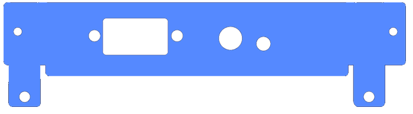

# A2320 Replacement Bracket
Custom replacemednt bracket for the A2320 deinterlacer board.

## Ordering Information
You can order these from any laser cutting service, such as [oshcut.com](https://app.oshcut.com/cart):
- Upload the SVG file found in the svg folder
- For material choose: 0.05" Aluminum 5052 H32
- Select a "custom size" and enter: 4.813 x 1.248 inches
- There is a minimum fee for setup, so the more you order the cheaper it works out per piece

## Assembly
- I would suggest wearing gloves to make sure you don't get little metal pieces on your hands, especially when threading the holes
- Sometimes when they arrive there can be some slight burn marks on the pieces, which can usually be cleaned off with an alcohol swab
- Use an M3 micro tap and tap wrench to thread the screw holes; then your original Amiga screws should fit
- Use a pliers to bend the tab pieces, then connect to your A2320 board using M2.5 (6mm) screws and nuts, or another other suitable option

