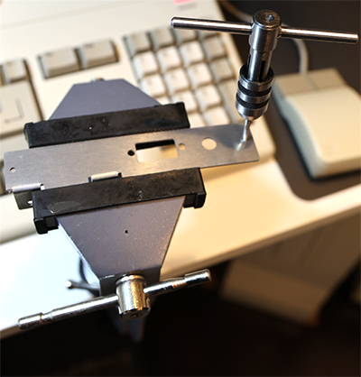
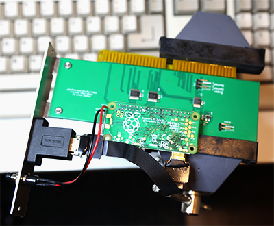

# Amiga 2000 Video Slot RGB2HDMI Bracket
Custom bracket for Amiga 2000 RGB2HDMI Video Slot V1.1 and earlier (https://github.com/Bloodmosher/Amiga-VideoSlot-RGBtoHDMI).

## Ordering Information
You can order these from any laser cutting service, such as [oshcut.com](https://app.oshcut.com/cart):
- Upload the SVG file found in the svg folder
- For material choose: 0.05" Aluminum 5052 H32
- Select a "custom size" and enter: 4.812 x 1.438 inches
- There is a minimum fee for setup, so the more you order the cheaper it works out per piece

## Assembly
- I would suggest wearing gloves to make sure you don't get little metal pieces on your hands, especially when threading the holes
- Sometimes when they arrive there can be some slight burn marks on the pieces, which can usually be cleaned off with an alcohol swab

- The next step is to bend the two tab pieces with a pliers:

   

- For the screw holes you'll need a tap wrench and an M3 tap
- If you don't have these tools you can order from [here](https://www.amazon.com/gp/product/B003GKJYKI/ref=ppx_yo_dt_b_search_asin_title?ie=UTF8&psc=1) and [here](https://www.amazon.com/gp/product/B07DPRVSCR/ref=ppx_yo_dt_b_search_asin_title?ie=UTF8&psc=1)
- Use the tap wrench with an M3 micro tap to thread the screw holes:

   

- Attach to the board with some appropriately sized screws and bolts. If the holes don't quite line up just bend the tab slightly to one side or the other.
- The ones used here are M2.5 (6mm)
   
   

- Attach your Pi and components
- I use this [coupler](https://www.amazon.com/gp/product/B071LDPR8H), [ribbon cable](https://www.amazon.com/gp/product/B07Z767H2H), and [button](https://www.amazon.com/gp/product/B07RPS2ZY3)
   
   

- Install in your Amiga 2000. You may need to bend the lower end of the bracket slightly to get it to fit.

- Run the sparkler tool to verify the board has no issues: https://github.com/Bloodmosher/AmigaSparkler
