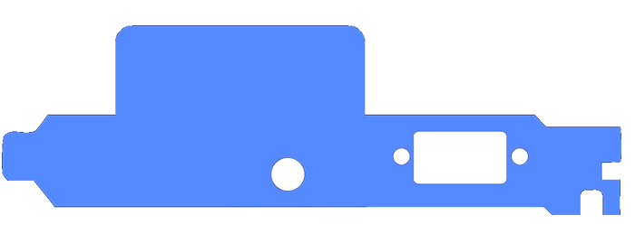
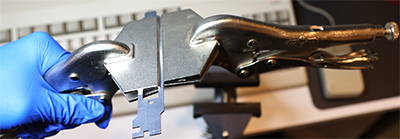
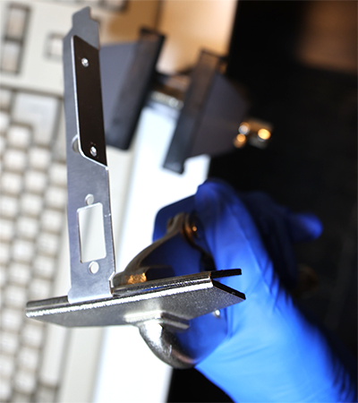
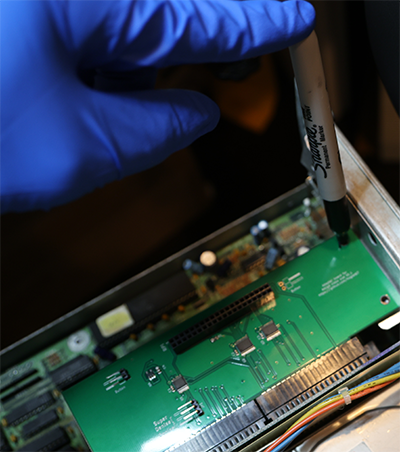
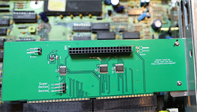
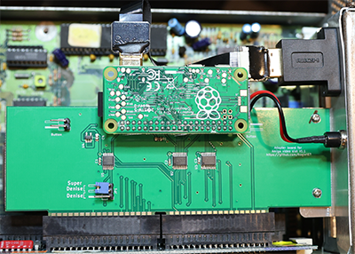

# Amiga 3000 Video Slot RGB2HDMI Bracket
Custom bracket for Amiga 3000 RGB2HDMI Video Slot V1.1 and earlier (https://github.com/Bloodmosher/Amiga-VideoSlot-RGBtoHDMI).

## Ordering Information
You can order these from any laser cutting service, such as oshcut.com:
- Upload the SVG file found in the svg folder
- For material choose: 0.032" Aluminum 5052 H32
- This bracket uses a thinner size than the A2000 bracket to allow easier bending
- On the large tab, screw holes have been omitted from the design, and instead you will mark and drill holes yourself (trust me this is easier than trying to get it to line up perfectly from the fab)
- Select a "custom size" and enter: 5.187 x 1.595 inches
- There is a minimum fee for setup, so the more you order the cheaper it works out per piece

## Assembly
- I would suggest wearing gloves to make sure you don't get little metal pieces on your hands, especially when threading the holes
- Sometimes when they arrive there can be some slight burn marks on the pieces, which can usually be cleaned off with an alcohol swab

- The next step is to bend the large tab using two vise grips or other sheet metal bending tool:

   

- Then bend the small tab using a single vise grip or other sheet metal bending tool
- It takes some practice to get this in just the right spot

   

- For the holes used to attach to the board:
   - First install the bracket and board into your A3000 (without attaching the bracket to your board)
   - You might need to bend the bottom of the bracket slightly to get it to fit into the A3000 receiving hole
   - Put the screw in place that holds the bracket to the A3000 case
   - Then mark with a pen or other tool the spot on the bracket where the holes should be drilled:

      

   - Remove the bracket from the machine
   - Drill the holes

- Re-install in your A3000 for a final fitting
- Attach to the board with some appropriately sized screws and bolts. If the holes don't quite line up just do one at a time and usually they can be made to work.
- The ones used here are M2.5 (6mm)
   
   

- Remove the board from the machine and then attach your Pi and components
- I use this [coupler](https://www.amazon.com/gp/product/B071LDPR8H), [ribbon cable](https://www.amazon.com/gp/product/B07Z767H2H), and [button](https://www.amazon.com/gp/product/B07RPS2ZY3)
   
   

- Install in your Amiga 3000 for testing
- Run the sparkler tool to verify the board has no issues: https://github.com/Bloodmosher/AmigaSparkler
